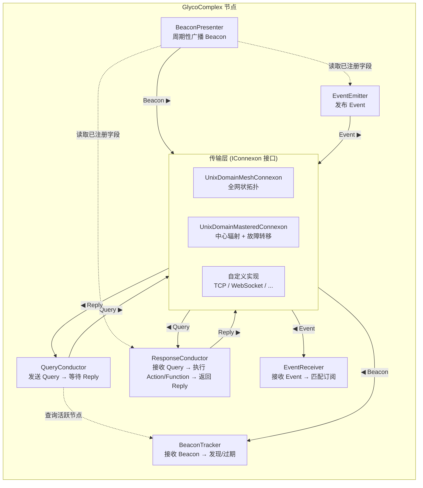

# Glycoprotein

一个 ~~比较新奇的~~ IPC/微服务通讯库. 节点能够自动发现彼此, 注册可调用的函数/动作/事件, 并通过 RPC, 即发即弃分发以及发布/订阅消息进行通信, 所有内容均通过可插拔的传输层后端传输.

## 架构

具体用法参见 `Glycoprotein.Demo`

本项目基于 [`LGPLv3`](https://www.gnu.org/licenses/lgpl-3.0.zh-cn.html) 获得许可