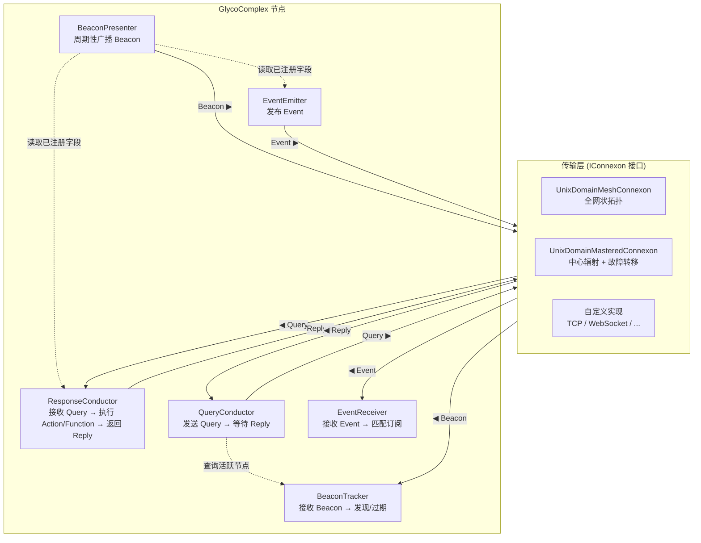

# Glycoprotein

一个 ~~比较新奇的~~ IPC/微服务通讯库. 节点能够自动发现彼此, 注册可调用的函数/动作/事件, 并通过 RPC, 即发即弃分发以及发布/订阅消息进行通信, 所有内容均通过可插拔的传输层后端传输.

## 架构



## 快速开始

### 基本用法

```csharp
using Glycoprotein;
using Glycoprotein.Connexon;

// --- 节点 Alpha: 提供 math_add 和一个动作 ---
var dir = Path.Combine(Path.GetTempPath(), $"demo-{Guid.NewGuid()}");
Directory.CreateDirectory(dir);

var alpha = new GlycoComplex("alpha", new UnixDomainMeshConnexon("alpha", dir));

alpha
    .AddFunction<AddRequest, AddResponse>("math_add",
        req => new AddResponse(req.A + req.B))
    .AddAction("do_status", () =>
        Console.WriteLine("Status action fired!"));

alpha.OnDiscovered += beacon => Console.WriteLine($"[alpha] 已发现: {beacon.Id}");

// --- 节点 Beta: 调用 alpha ---
var beta = new GlycoComplex("beta", new UnixDomainMeshConnexon("beta", dir));

// 启动两个节点, 让它们相互发现
await alpha.StartAsync();
await beta.StartAsync();

await Task.Delay(2000); // 等待发现信标的广播

// Beta 调用 Alpha 的 math_add
var result = await beta.CallFunctionAsync<AddRequest, AddResponse>("alpha", "math_add",
    new AddRequest(10, 25));
Console.WriteLine($"10 + 25 = {result?.Result}");

// Beta 在 Alpha 上分发一个动作
await beta.DoActionAsync("alpha", "do_status");

// 清理
alpha.Dispose();
beta.Dispose();
Directory.Delete(dir, true);

// --- 上文使用的记录(Record)类型 ---
record AddRequest(int A, int B);
record AddResponse(int Result);
```

### 事件发布/订阅

```csharp
// 声明一个事件类型
record HeartbeatMessage(string NodeId, DateTime Time);

// 节点 A 发布心跳
alpha.AddEvent<HeartbeatMessage>("evt_heartbeat");

// 节点 B 订阅节点 A 的心跳
beta.OnEvent<HeartbeatMessage>("alpha", "evt_heartbeat",
    msg => Console.WriteLine($"[Beta] 收到心跳: 来自 {msg.NodeId}, 时间 {msg.Time}"));

// 节点 A 触发事件
await alpha.EmitEventAsync("evt_heartbeat",
    new HeartbeatMessage("alpha", DateTime.UtcNow));
```

## 传输层

### UnixDomainMeshConnexon(全网状拓扑)

每个节点在共享目录中绑定一个 `.sock` 文件. 节点通过扫描其他的套接字文件来发现彼此, 连接到每一个对等节点, 并将收到的消息转发给所有已连接的对等节点.

```csharp
var dir = Path.Combine(Path.GetTempPath(), "mesh-demo");
Directory.CreateDirectory(dir);

var node = new GlycoComplex("node-1", new UnixDomainMeshConnexon("node-1", dir));
```

### UnixDomainMasteredConnexon(中心辐射型拓扑)

一个节点会成为中心节点(第一个绑定 `hub.sock` 的节点). 所有其他节点作为客户端连接到该中心. 中心节点负责在客户端之间中继消息. 如果中心节点宕机, 剩余的节点会竞选成为新的中心节点.

```csharp
var dir = Path.Combine(Path.GetTempPath(), "hub-demo");
Directory.CreateDirectory(dir);

var node = new GlycoComplex("node-1", new UnixDomainMasteredConnexon("node-1", dir));
```

### 自定义传输

实现 `IConnexon` 接口以添加你自己的传输方式(TCP, 命名管道, WebSocket 等) ~~比如现在就有一个不推荐使用的UDP多播连接子实现www~~:

```csharp
public interface IConnexon : IDisposable
{
    event Action<Glycosyl>? OnGlycosylReceived;
    CancellationToken CancellationToken { get; }

    void Start();
    void Stop();
    Task SendAsync(Glycosyl glycosyl, CancellationToken ct = default);
    Task SendBytesAsync(byte[] data, CancellationToken ct = default);
    void SendBytes(byte[] data);
    void Send(Glycosyl glycosyl);
}
```

## 节点 API 参考

`GlycoComplex` 提供了一套用于定义节点能力的流式 API:

| 方法 | 描述 |
|---|---|
| `AddAction(fid, action)` | 注册一个即发即弃(fire-and-forget)动作 |
| `AddFunction<TReq, TRes>(fid, func)` | 注册一个强类型 RPC 函数 |
| `AddRawFunction(fid, func)` | 注册一个原生(JsonElement)RPC 函数 |
| `AddEvent(fid)` / `AddEvent<T>(fid)` | 声明一个需发布的事件 |
| `OnEvent(gid, fid, handler)` | 订阅一个事件(无类型) |
| `OnEvent<T>(gid, fid, handler)` | 订阅一个强类型事件 |
| `OnEventRaw(gid, fid, handler)` | 订阅一个原生 JsonElement 事件 |
| `CallFunctionAsync<TRes>(gid, fid)` | 调用远程函数并获取结果 |
| `DoActionAsync(gid, fid)` | 即发即弃地调用一个远程动作 |
| `EmitEventAsync(fid)` / `EmitEventAsync<T>(fid, arg)` | 发布一个事件 |
| `EmitEventRawAsync(fid, arg)` | 发布一个原生事件 |
| `StartAsync()` | 开始广播信标并处理消息 |
| `Dispose()` | 停止节点并释放所有资源 |

## 消息(传输格式)

所有消息都继承自抽象的 `Glycosyl` 类, 并使用 `Type` 区分字段序列化为 JSON:

| 类型 (Type) | 用途 | 关键字段 |
|---|---|---|
| `Beacon` | 节点能力宣告 | `Id`, `Fields[]` |
| `Query` | RPC 请求 | `Gid`, `Fid`, `Payload`, `Qid` |
| `Reply` | RPC 响应 | `Payload`, `Qid` |
| `Event` | 发布/订阅事件 | `Gid`, `Fid`, `Arg` |

```json
{
  "Type": "Query",
  "Gid": "alpha",
  "Fid": "math_add",
  "Payload": { "A": 10, "B": 25 },
  "Qid": "a1b2c3d4-..."
}
```

## 字段类型

| 字段类型 | 行为 |
|---|---|
| `Action` | 即发即弃 - 不期望收到响应 ~~当然你要等它完成也是支持的~~ |
| `Function` | 请求/响应 - 支持为请求和响应的负载(Payload)提供可选的 JSON Schema |
| `Event` | 发布/订阅 - 支持为事件参数提供可选的 JSON Schema |

## 依赖项

| 包名 | 版本 | 用途 |
|---|---|---|
| `JsonSchema.Net` | 9.2.2 | 用于验证函数/事件负载的 JSON Schema |